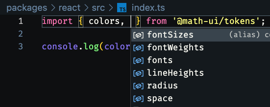

# Setup

1. Criaremos um novo projeto no vscode;
2. Após isso iremos criar duas pastas: packages > tokens.
3. Entraremos na pasta tokens e lançamos um "npm init -y"
4. Dentro deste package gerado mudar a chave "name" para name: "@nome_da_org/tokens"
5. criar uma pasta 'src' e adicionar seus arquivos de tokens (colors.ts, fontsFamily, fontsWeights e etc...)
6. Em seguida, criar um arquivo index.ts para fazer as importações de todos os tokens;
```ts
// packages > tokens > src > colors.ts

export const colors = {
  white: '#FFF',
  black: '#000',

  gray100: '#E1E1E6',
  gray200: '#A9A9B2',
  gray400: '#7C7C8A',
  gray500: '#505059',
  gray600: '#323238',
  gray700: '#29292E',
  gray800: '#202024',
  gray900: '#121214',

  ignite300: '#00B37E',
  ignite500: '#00875F',
  ignite700: '#015F43',
  ignite900: '#00291D',
}


// packages > tokens > src > index.ts

export * from './colors'

```

7. No package do tokens, iremos add o typescript (npm i -D typescript), em seguida "npx tsc --init"
8. Iremos instalar o [tsup](https://github.com/egoist/tsup), lançando o comando "npm i -D tsup" (Ferramenta para fazer a conversão de TS -> JS ou ECMA) 
9. Após a instalação do tsup iremos adicionar dois scripts

```JSON
{
  // ...
  "scripts": {
    "build": "tsup src/index.ts --format esm,cjs --dts",
    "dev": "tsup src/index.ts --format esm,cjs --dts --watch"
  },
  // ...
}
```

## 10. Configurando o MONOREPO

Monorepo - Colocar vários projetos em único repositório/mesmo espaço de trabalho. A questão principal para qual utilizamos essa abordagem é quando esses projetos tem dependências com os outros projetos do monorepo.

--- 
No nosso design system, iremos criar uma nova pasta chamada react. 
Entrando nela, iremos iniciar o package.json(npm init -y) e adicionar o TS e o tsup como dependências de desenvolvimento.

Usaremos o monorepo porque o react é dependente do tokens e vice-versa. Quando um for alterado o outro também será.

---
##### - Importação entre os dois pacotes (react e tokens)

###### Parte 1:

1. Iremos voltar para a pasta root, em seguida, iniciar o package.json(npm init -y)


2. Iremos deixar o nosso package desta forma: 

```JSON
{
  "private": true,
  "workspaces": [
    "packages/*"
  ]
}
```

3. Em seguidda, apagaremos o node_modules do react e do tokens e informaremos no package do react, que ele tem uma devDependencies com o nosso pacote de tokens:

```JSON
{
  // ... other configs
  "devDependencies": {
    "@math-ui/tokens": "*",
      // ... other dependencies
  }
}
```

4. Após isso, iremos retornar a pasta root e lançar o comando "npm i".


Agora as dependências são gerenciadas de forma global. Quando os dois pacotes usam alguma depedência igual, ela é baixada uma única fez.
Depois disso podemos apagar o "package.lock.json" da pasta react e tokens. 

5. Para que a gente consiga fazer alguma importação de tokens para react e vice-versa, precisamos no "package.json" de cada um deles passar alguns comandos para que outras pastas consigam acessar as informações.
 
```JSON
{
  "main": "./dist/index.js",
  "module": "./dist/index.mjs",
  "types": "./dist/index.d.ts",
  "scripts": {
    // ... scripts
  },
  "devDependencies": {
      // ... dependencies
  }
}
```

6. Após isso, entraremos no tokens e lançaremos o comando "npm run build" e depois entraremos em qualquer arquivo do projeto react e importaremos os tokens da pasta de tokens, sem problemas.



###### Parte 2: Configurando o TypeScript

Você irá perceber que quando tentar fazer o build da pasta do react, dará erro. Isso é porque ainda não configuramos o TypeScript. 
Aqui iremos criar uma configuração do TypeScript que pode ser compartilhada para diversos pacotes(tokens, react...)

1. criaremos um pacote ts-config e iniciaremos o package:

```JSON
{
  "name": "@math-ui/ts-config",
  "version": "1.0.0",
  "license": "MIT",
  "private": true
}
```

2. Adicionaremos um arquivo no ts-config chamado "base-config" para adicionarmos as configurações base do TS para todos os pacotes (exceto pacotes que utilizam React):

```JSON
{
  "compilerOptions": {
    "composite": false,
    "declaration": true,
    "declarationMap": true,
    "esModuleInterop": true,
    "forceConsistentCasingInFileNames": true,
    "inlineSources": false,
    "isolatedModules": true,
    "moduleResolution": "node",
    "noUnusedLocals": false,
    "noUnusedParameters": false,
    "preserveWatchOutput": true,
    "skipLibCheck": true,
    "strict": true
  },
  "exclude": ["node_modules"]
}
```

3. Também criaremos um "react.json" para as configs do TS para pacotes que usam React

``` JSON
{
  "extends": "./base.json",
  "compilerOptions": {
    "jsx": "react-jsx",
    "lib": ["dom", "ES2015"],
    "module": "ESNext",
    "target": "es6"
  }
}
```

4. Agora iremos referenciar o pacote ts-config nos package dos outros pacotes.

``` JSON
// tokens
{
  // other configs
  "devDependencies": {
    "@math-ui/ts-config": "*",
    "tsup": "^7.1.0",
    "typescript": "^5.1.6"
  }
}
// react
{
  // other configs
  "devDependencies": {
    "@math-ui/ts-config": "*",
    "@math-ui/tokens": "*",
    "tsup": "^7.1.0",
    "typescript": "^5.1.6"
  }
}
```

5. Agora voltamos ao root do nosso projeto e lançamos um "npm i" para ele atribuir a referência do ts-config aos outros pacotes.

6. Na pasta tokens, iremos no "tsconfig.json" e escrevemos esse código:
* Caso não exista, deve criar o arquivo
``` JSON
{
  "extends": "@math-ui/ts-config/base.json",
  "include": ["src"]
}
```

7. Na pasta react, iremos no "tsconfig.json" e escrevemos esse código:
* Caso não exista, deve criar o arquivo

``` JSON
{
  "extends": "@math-ui/ts-config/react.json",
  "include": ["src"]
}
```

8. Agora voltamos ao root do nosso projeto e lançamos um "npm i" para verificar se está faltando algo.

9. Ao final, lançamos o comando "npm run build" tanto no tokens quanto no react e o retorno deve ser este:


**Parabéns 🎉** Você concluiu a importação entre os dois pacotes.

---

##### - Configurando o ESLINT

1. Criaremos mais um pacote chamado eslint-config.


2. Iremos acessar a página e lançar um "npm init -y" e nosso package deve ficar assim: 

``` JSON
{
  "name": "@math-ui/eslint-config",
  "license": "MIT",
  "private": "true",
  "main": "index.js",
  "devDependencies": {
    "@rocketseat/eslint-config": "^2.0.1",
    "eslint": "^8.45.0"
  }
}
```

3. Criaremos uma página index.js e ela deve ficar assim:

``` JS
module.exports = {
  extends: ['@rocketseat/eslint-config/react']
}
```

4. Agora iremos importar esse pacote nos outros, exceto no ts-config.

``` JSON
// tokens
{
  // other configs
  "devDependencies": {
    "@math-ui/eslint-config": "*",
    "@math-ui/ts-config": "*",
    "tsup": "^7.1.0",
    "typescript": "^5.1.6"
  }
}
// react
{
  // other configs
  "devDependencies": {
    "@math-ui/eslint-config": "*",
    "@math-ui/ts-config": "*",
    "@math-ui/tokens": "*",
    "tsup": "^7.1.0",
    "typescript": "^5.1.6"
  }
}
```

5. No pacote React e Tokens criaremos um arquivo de config do eslint. Ele deve ficar dessa forma:

``` JSON
// .eslintrc.json
{
  "extends": "@math-ui/eslint-config"
}
```

6. Em ambos adicionaremos o script de lint: 

``` JSON
{
  "scripts": {
    "build": "tsup src/index.ts --format esm,cjs --dts",
    "dev": "tsup src/index.ts --format esm,cjs --dts --watch",
    "lint": "eslint src/**/*.ts* --fix"
  },
}
```

7. Lançamos o comando "npm run lint" para fazer as correções.

-  Verificar se o ESLINT realmente está aplicando as regras

**Parabéns 🎉** Você concluiu a configuração do ESLINT.
